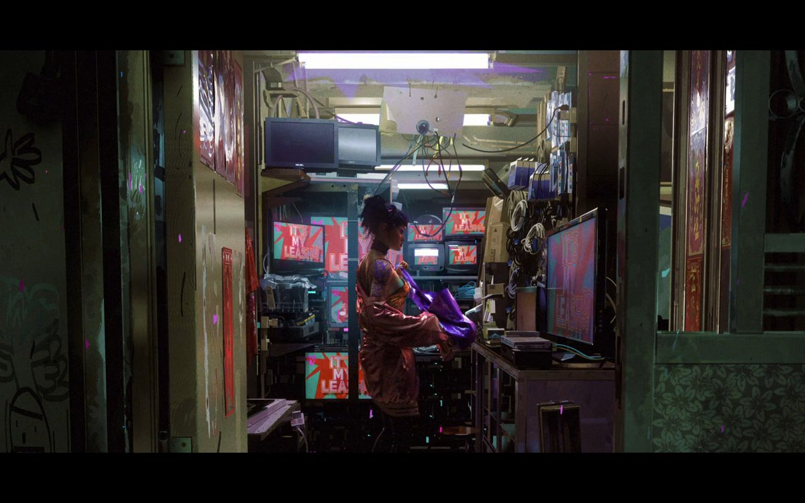
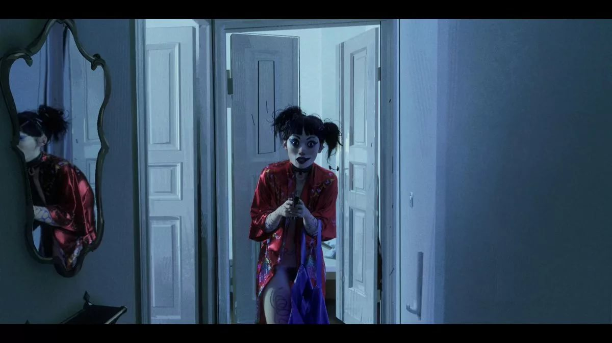
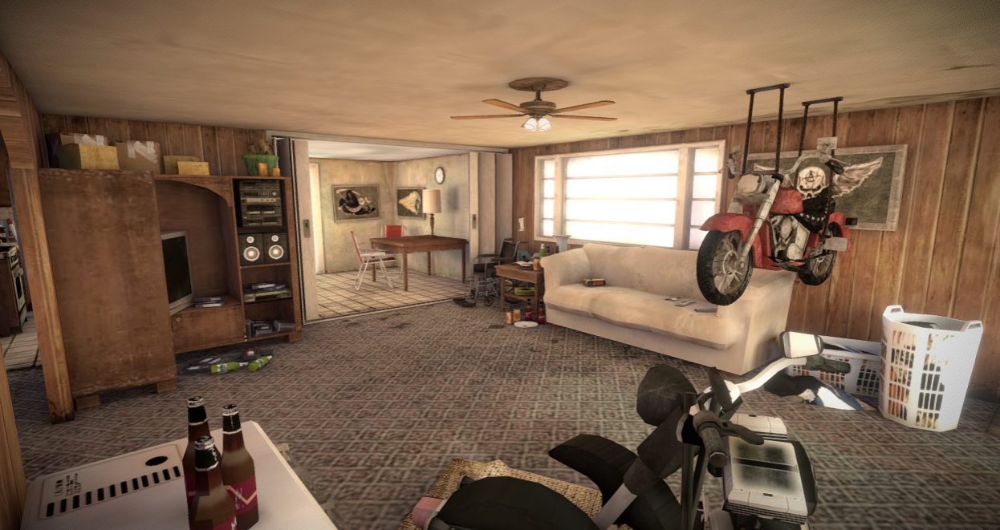
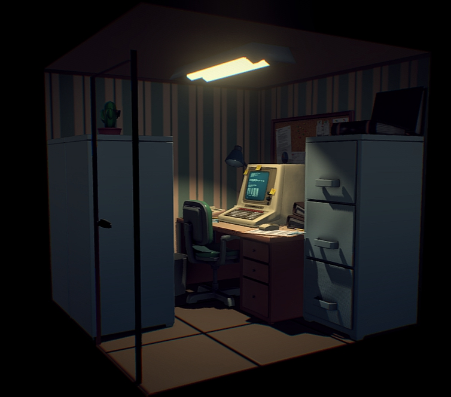
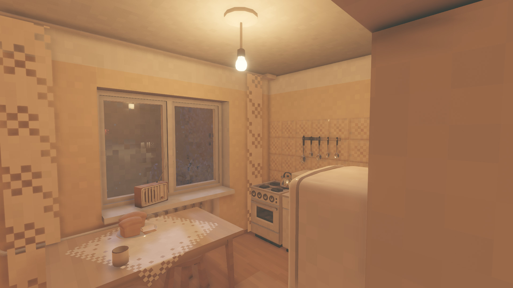

# CG-artist-test-2019
Тестовое задание для CG Artist
## Описание
Суть задания заключается в моделировании и визуализации пространства, исходя из предложеных референсов, а так же передачи какой то истории или атмосферы, используя только окружение.
Обязателен к исполнению только базовый уровень и демонстрация полигональной сетки любым предложеным вариантом. Остальные задания проработать по мере возможности. Но чем больше, тем лучше конечно же.

## Референс

## Базовый уровень
Смоделирвоать любой интерьер в стилистике диорам или полноценной команты под VR/AR. Все модели необходимо оптимизировать с оглядкой на "необходимость" их использованеи в VR/AR.
Исходя из задачи, необходимо показать красивую подачу вашей задумки. Т.е. необходимо проработать атмосферу через игру света и тени, либо через предметы рассказать какую либо историю.
На данном уровне возможно использование Base color материалов.

## Средний уровень
Затекстурировать интерьер в Substance Painter или любой другой программе и использовать более сложные текстурные атласы: Base Color, AO, Normal map (Запеченный желательно), Metall/Spec, Rough/Smooth и т.д.
На данном уровне преследуется цель создания реалистичной и красивой атмосферы, так же с целью использования проекта под VR/AR.

## Продвинутый уровень
Ориентир на стлизацию и способности осваивать сложные задачи. В данном слуае это работа с реалистичным светом, а так же стилизованными объектами. Один из основных референсов сериал Love Death and Robot серия "The Witness".
Одна из основных сложностей тут, это способность оптимизировать модели и стилистическую задумку под VR/AR.

## Дополнительное задание
Наша компания работает с проектами под Unity. Огромным плюсом будет экспорт модели и текстур в Unity и попытка настройки сцену в ней. К исполнению предлагается версии Unity от 2018.3 и выше.
Вы так же можете написать Shaders анимированые материалы или спецэфекты используя любую систему частиц. Чем более живее будет ваша сцену, тем круче :)

## Экспорт
Для просмотра и оценки задания необходимо загрузить модель на SketchFab или Marmoset. Либо продемонстрировать проект через Unity Package.

## Ограничения и допущения
3D-редактор можно использовать любой.
Чем больше уровней вы сделате, тем лучше. Однако на отлично можно выполнить и базовый уровень с дополнительным заданием, которого будет достаточно.
Важно понимать что проект, якобы, ориентируется под VR/AR, а значит необходимо использовать как можно меньше полигонов. В данном задание специально не сказано какой полигональный бюджет мы даем.
